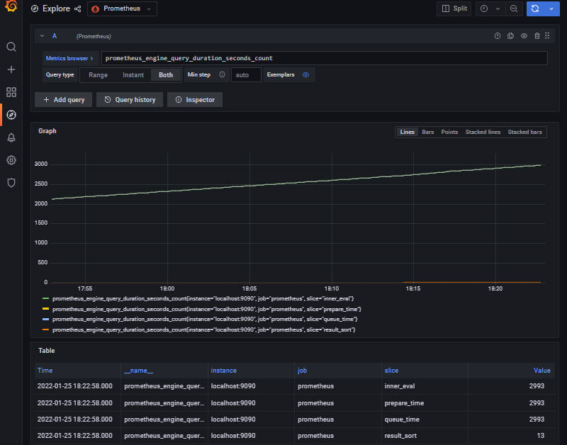

## Compose sample
### Prometheus & Grafana

Project structure:
```
.
├── alertmanager
│   └── alertmanager.yml
├── docker-compose.yml
├── grafana
│   └── datasource.yml
├── output.jpg
├── prometheus
│   ├── prometheus.yml
│   └── rules
│       ├── hoststats.alert.yml
│       └── memory.yml
├── prometheus-webhook-dingtalk
│   ├── config.yml
│   └── dingtalk
│       └── template.tmpl
└── README.md

```

[_docker-compose.yml_](docker-compose.yml)
```
version: "3.7"
services:
  prometheus:
    image: prom/prometheus
    ...
    ports:
      - 9090:9090
  grafana:
    image: grafana/grafana
    ...
  prometheus-webhook-dingtalk:
    image: timonwong/prometheus-webhook-dingtalk
    ...
  alertmanager:
    image: quay.io/prometheus/alertmanager
    ...
    ports:
      - 3000:3000
```
The compose file defines a stack with four services `prometheus` ,`grafana`,`alertmanager`and `prometheus-webhook-dingtalk`.
When deploying the stack, docker-compose maps port the default ports for each service to the equivalent ports on the host in order to inspect easier the web interface of each service.
Make sure the ports 9090 and 3000 and 8060 and 9093 on the host are not already in use.

## Deploy with docker-compose

```
$ docker-compose up -d
Creating network "prometheus-grafana_default" with the default driver
Creating volume "prometheus-grafana_prom_data" with default driver
...
Creating grafana                     ... done
Creating prometheus-webhook-dingtalk ... done
Creating alertmanager                ... done
Creating prometheus                  ... done

Attaching to prometheus, grafana, alertmanager, prometheus-webhook-dingtalk

```

## Expected result

Listing containers must show two containers running and the port mapping as below:
```
$ docker ps
CONTAINER ID        IMAGE               COMMAND                  CREATED             STATUS              PORTS                    NAMES
6091a20315de   prom/prometheus                                            "/bin/prometheus --c…"   6 minutes ago   Up 6 minutes   0.0.0.0:9090->9090/tcp
101aebe33bee   quay.io/prometheus/alertmanager                            "/bin/alertmanager -…"   6 minutes ago   Up 6 minutes   0.0.0.0:9093->9093/tcp
a32127cde56f   timonwong/prometheus-webhook-dingtalk                      "/bin/prometheus-web…"   6 minutes ago   Up 6 minutes   0.0.0.0:8060->8060/tcp
6636c57c2e2c   grafana/grafana                                            "/run.sh"                6 minutes ago   Up 6 minutes   0.0.0.0:3000->3000/tcp
```

Navigate to `http://localhost:3000` in your web browser and use the login credentials specified in the compose file to access Grafana. It is already configured with prometheus as the default datasource.



Navigate to `http://localhost:9090` in your web browser to access directly the web interface of prometheus.

Stop and remove the containers. Use `-v` to remove the volumes if looking to erase all data.
```
$ docker-compose down -v
```
